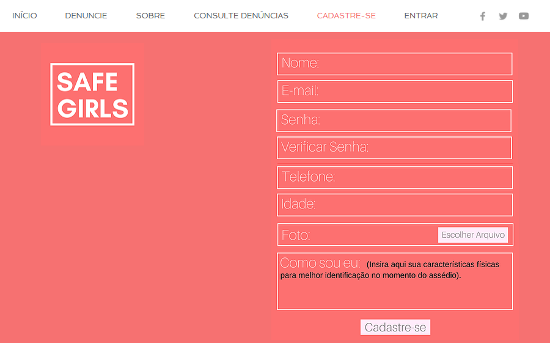
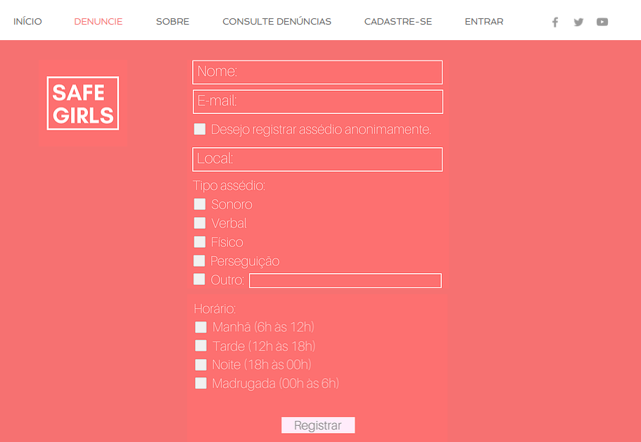
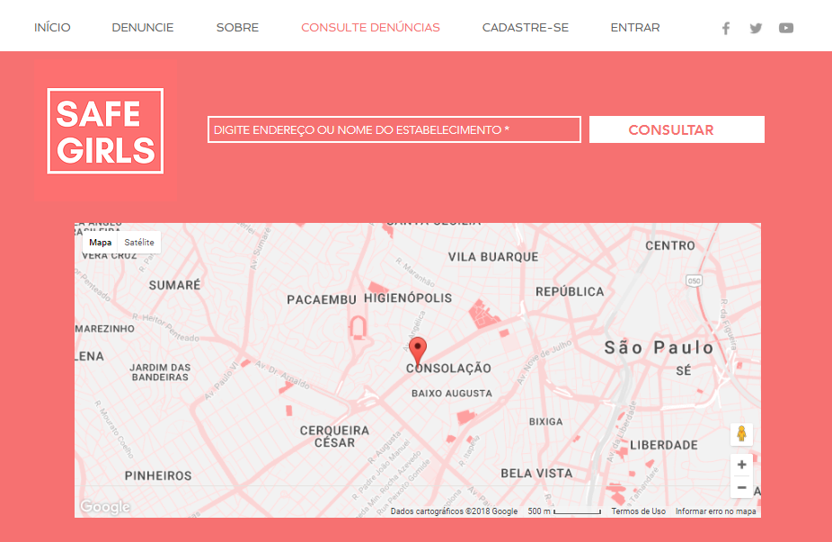

# Documento de Visão do Projeto SafeGirls

Este documento apresenta uma solução de software para o projeto *SafeGirls*, solicitado pelo cliente *Tomaz Mikio Sasaki*, 
apresentando os problemas a serem solucionados, as necessidades dos principais envolvidos, o alcance do projeto e as funcionalidades 
esperadas do sistema.

## Objetivos

* Objetivo do aplicativo é evitar a tentativa de assédio, violência ou até mesmo estupro contra a mulher além gerar visibilidade para casos de assédio e violência e, assim, identificar lugares violentos espalhados pelo país e definir as zonas em que há mais casos de assédio, sendo publicados as ocorrências e expostos para sociedade.  

## Problema

* Descrição do problema: Assédio sexual e a violência contra as mulheres.
* Quem é afetado pelo problema: Mulheres de todas as idades.
* Impacto no negócio: A mulher vítima foi objeto de repressão, violência, não só nos espaços públicos, mas privados, dentro da família, em casa, no trabalho. As consequências podem ter reflexos na saúde física e emocional das mulheres. Isso porque a assediada corre risco de desenvolver distúrbios como ansiedade, depressão, perda ou ganho de peso, dores de cabeça, estresse e problemas no sono.
* Benefícios de uma boa solução: Aplicação mobile que com apenas um botão a vítima do assédio notifique outros usuários próximos a sua localização e uma plataforma Web onde as vítimas possam registar anonimamente ou identificadas por meio de um cadastro, denúncias de assédio e violência informando local, tipo de assédio e horário assim disponibilizando a ocorrência para outros visitantes eu usuários.

## Definições, abreviações e outros termos do domínio do problema

* Visibilidade: Ato pelo qual os itens(denúncias) cadastrados tornam-se válidos e divulgados.

## Integração com outros sistemas

* Google Maps

## Interessados

* Gerente de Projeto
* Depto. de TI

## Usuários

* Vitima de assédio e violência(Responsáveis por registrar denúncia): Usuário que possui acesso a aplicação e a registro de denuncias de forma anonima ou por meio de cadastro.
* Visitante (Qualquer cidadão que tem curiosidade/ necessidade em verificar ocorrencia de assédio e violência em determinado local):   Usuários que possuem acesso a um computador desktop e/ou notebooks e acesso à internet.

## Funcionalidades do produto

* Cadastro de Usuário
* Cadastro de Denúncia
* Consulta de Denúncia

## Restrições do projeto

* Utilização da ferramenta de banco de dados. 
* Uso de Web Service nas integrações, e na publicação de serviços externos (Internet/Intranet). 

## Protótipos de tela

### Protótipos para funcionalidade: Cadastro de Usuário

Fonte: Exemplos gerados pelo assistente do **WIX.com**.

### Protótipos para funcionalidade: Cadastro de Denúncia

Fonte: Exemplos gerados pelo assistente do **WIX.com**.

### Protótipos para funcionalidade: Consulta de Denúncia

Fonte: Exemplos gerados pelo assistente do **WIX.com**.
