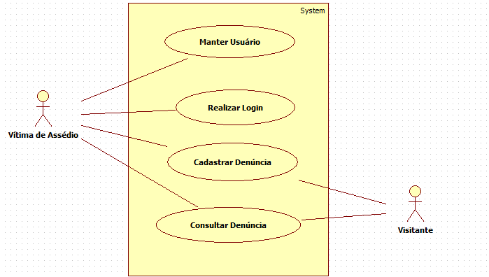

# Casos de uso

## 1. Diagrama de casos de uso: Manter Usuário (UC01)

## 1.1. Especificação dos casos de uso

Permite que sejam criados novos usuários no sistema.

### 1.2. Caso de uso **Cadastrar Usuário**

| Campo          | Informação        |
|---|---|
| Identificador: | UC01              |
| Nome:          | Cadastar Uduário |
| Atores:        | Vítima de Assédio |
| Sumário:       | Cadastro do usuário no sistema. |

| Fluxo Principal |
|---|
| 1) O caso de uso se inicia quando o usuário seleciona a opção cadastre-se.|
| 2) O usuário preenche os dados.                 |
| 3) O usuário aperta no botão "Cadastre-se" para enviar seus dados. |
| 4) O sistema verifica os dados digitados. |
| 5) O sistema guarda os dados do usuário. |
| 6) O sistema encaminha o usuário para página inicial e retorna mensagem de sucesso de cadastro. |

| Fluxo Alternativo (1a): O usuário não preencheu os dados corretamente. |
|---|
| 1) O sistema informa que usuário preencheu dados incorretamente. |
| 2) O sistema solicita preenchimento dos dados novamente sinalizando qual campo não foi preenchido de forma correta. |
| 3) Volta ao passo (4) do fluxo principal. |

| Fluxo Alternativo (1b): O usuário não preencheu todos os dados. |
|---|
| 1) O sistema informa que usuário não preencheu todos os dados incorretamente. |
| 2) O sistema solicita preenchimento dos dados novamente sinalizando qual campo não foi preenchido. |
| 3) Volta ao passo (4) do fluxo principal. |

| Fluxo Alternativo (1c): O usuário preencheu e-mail de alguém que já está cadastrado |
|---|
| 1) O sistema informa que usuário preencheu e-mail de que já foi cadastrado. |
| 2) O sistema solicita preenchimento dos dados novamente sinalizando que já existe cadastro. |
| 3) Volta ao passo (2) do fluxo principal. |

## 2. Diagrama de casos de uso: Manter Usuário (UC01)

## 2.1. Especificação dos casos de uso

Permite que sejam alterados cadastros de usuários no sistema.

### 2.2. Caso de uso **Alterar Usuário**

| Campo          | Informação        |
|---|---|
| Identificador: | UC01              |
| Nome:          | Alterar Usuário |
| Atores:        | Vítima de Assédio|
| Sumário:       | Altera usuário no sistema |

| Fluxo Principal |
|---|
| 1) O usuário clica em “Perfil” |
| 2) O sistema redireciona o usuário para a página de perfil.                   |
| 3) O usuário altera os dados. |
| 4) O usuário confirma a alteração. |
| 5) O sistema verifica os dados digitados. |
| 6) O sistema salva os dados alterados.|
| 7) O sistema encaminha o usuário para página inicial e retorna mensagem de sucesso de alteração. |

| Fluxo Alternativo (2a): O usuário não preencheu os dados corretamente. |
|---|
| 1) O sistema informa que usuário preencheu dados incorretamente. |
| 2) O sistema solicita preenchimento dos dados novamente sinalizando qual campo não foi preenchido de forma correta. |
| 3) Volta ao passo (4) do fluxo principal. |

| Fluxo Alternativo (2b): O usuário não preencheu todos os dados. |
|---|
| 1) O sistema informa que usuário não preencheu todos os dados incorretamente. |
| 2) O sistema solicita preenchimento dos dados novamente sinalizando qual campo não foi preenchido. |
| 3) Volta ao passo (4) do fluxo principal. |

## 3. Diagrama de casos de uso: Manter Usuário (UC01)

## 3.1. Especificação dos casos de uso

Descrição Permite que sejam excluídos cadastros de usuários do sistema.

### 3.2. Caso de uso **Excluir Usuário**

| Campo          | Informação        |
|---|---|
| Identificador: | UC01              |
| Nome:          | Excluir Usuário |
| Atores:        | Vítima de Assédio |
| Sumário:       | Exclui cadastro do sistema |

| Fluxo Principal |
|---|
| 1) O usuário clica em “Perfil” |
| 2) O usuário é encaminhado para a página de perfil.                |
| 3) O usuário clica na opção “Excluir Cadastro”. |
| 4) O usuário confirma a opção de excluir cadastro. |
| 5) O sistema exclui os dados do usuário.|
| 6) O sistema encaminha o usuário para página inicial e retorna mensagem de sucesso de exclusão.|

| Fluxo Alternativo (3a): Usuário deseja cancelar exclusão de cadastro. |
|---|
| 1) o usuário clicou em “Cancelar” na caixa de diálogo de confirmação para excluir conta. |
| 2) Volta ao passo (2) do fluxo principal. |

## 4. Diagrama de casos de uso: Manter Usuário (UC01)

## 4.1. Especificação dos casos de uso

Permite que sejam visualizados os dados de cadastro de usuários do sistema.

### 4.2. Caso de uso **Ver Usuário**

| Campo          | Informação        |
|---|---|
| Identificador: | UC01              |
| Nome:          | Ver Usuário |
| Atores:        | Vítima de Assédio |
| Sumário:       | Visualiza cadastro no sistema |

| Fluxo Principal |
|---|
| 1) O usuário clica em “Perfil” |
| 2) O usuário é encaminhado para a página de perfil.                |
| 3) O usuário visualiza seus dados cadastrais. |
| 4) O usuário clica na opção de voltar à página inicial. |
| 5) O sistema encaminha o usuário para página inicial.|

## 5. Diagrama de casos de uso: Realizar Login (UC02)

## 5.1. Especificação dos casos de uso

Permite que usuários cadastrados tenham acesso a sua conta.

### 5.2. Caso de uso **Realizar Login**

| Campo          | Informação        |
|---|---|
| Identificador: | UC02              |
| Nome:          | Realizar Login |
| Atores:        | Vítima de Assédio |
| Sumário:       | Realiza login no sistema |

| Fluxo Principal |
|---|
| 1) O caso de uso se inicia quando o usuário seleciona a opção de “Entrar” na página principal. |
| 2) O sistema encaminha o usuário para a página de login.                |
| 3) O usuário preenche seus dados na página de login. |
| 4) O usuário aperta no botão "Entrar" para enviar seus dados. |
| 5) O sistema verifica os dados digitados.|
| 6) O sistema encaminha o usuário para sua página de perfil.|

| Fluxo Alternativo (5a): O usuário preencheu uma matrícula que não existe. |
|---|
| 1) O sistema informa que usuário preencheu dados incorretamente. |
| 2) O sistema solicita preenchimento dos dados novamente sinalizando que o usuário digitado não existe. |
| 3) Volta ao passo (3) do fluxo principal. |

| Fluxo Alternativo (5a): O  usuário digitou a senha incorreta. |
|---|
| 1) O sistema informa que usuário senha incorretamente. |
| 2) O sistema solicita preenchimento dos dados novamente sinalizando que a senha digitada não confere. |
| 3) Volta ao passo (3) do fluxo principal. |

## 6. Diagrama de casos de uso: Consultar Denúncias (UC03)

## 6.1. Especificação dos casos de uso

Permite que usuários cadastrados e visitantes consultem denúncias.

### 6.2. Caso de uso **Consultar Denúncias**

| Campo          | Informação        |
|---|---|
| Identificador: | UC03              |
| Nome:          | Consultar Denúncias |
| Atores:        | Vítima de Assédio (Principal): consulta suas próprias denúncias e qualquer outra. Visitante: pode consultar qualquer denúncia. |
| Sumário:       | Consulta denúncias do sistema |

| Fluxo Principal |
|---|
| 1) O caso de uso se inicia quando o usuário seleciona a opção de “Minhas Denúncias” na barra de menu. |
| 2)  O sistema encaminha o usuário para a página de denúncias e lista todas as suas denúncias.                |
| 3) O usuário consulta todas suas denúncias. |
| 4) O usuário clica no botão de "Voltar".|
| 5) O sistema encaminha o usuário para a página inicial.|

| Fluxo Alternativo (6a): Visitante deseja consultar denúncias. |
|---|
| 1) O caso de uso se inicia quando o visitante seleciona a opção de “Consulte Denúncias” na barra de menu. |
| 2) O sistema encaminha o usuário para a página de consultar denúncia                |
| 3) O visitante insere dados do local de consulta de denúncia. |
| 4) O visitante clica no botão de "Voltar".|
| 5) O sistema encaminha o usuário para a página inicial.|

## 7. Diagrama de casos de uso: Cadastrar Denúncia (UC04)

## 7.1. Especificação dos casos de uso

Permite que usuários cadastrem uma denúncia de assédio.

### 7.2. Caso de uso **Cadastrar Denúncias**

| Campo          | Informação        |
|---|---|
| Identificador: | UC04              |
| Nome:          | Cadastrar Denúncias |
| Atores:        | Vítima de Assédio (Principal)e Visitante |
| Sumário:       | Cadastrar denúncias do sistema |

| Fluxo Principal |
|---|
| 1) O caso de uso se inicia quando o usuário seleciona a opção de “Denuncie” na barra de menu. |
| 2) O sistema encaminha o usuário para a página de cadastro de denúncias.                |
| 3) O usuário preenche formulário. |
| 4) O usuário clica no botão de "Registrar".|
| 5) O sistema efetua a denúncia, exibindo uma mensagem de sucesso ao usuário.|

| Fluxo Alternativo (7a): Visitante deseja cadastrar denúncia. |
|---|
| 1) Este fluxo inicia-se no passo (1) do fluxo principal |
| 2) O sistema encaminha o visitante para a página de cadastro de denúncias.                |
| 3) O usuário preenche formulário e seleciona opção "Desejo registrar denúncia anonimamente. |
| 4) O usuário clica no botão de "Registrar".|
| 5) O sistema efetua a denúncia, exibindo uma mensagem de sucesso ao visitante.|

